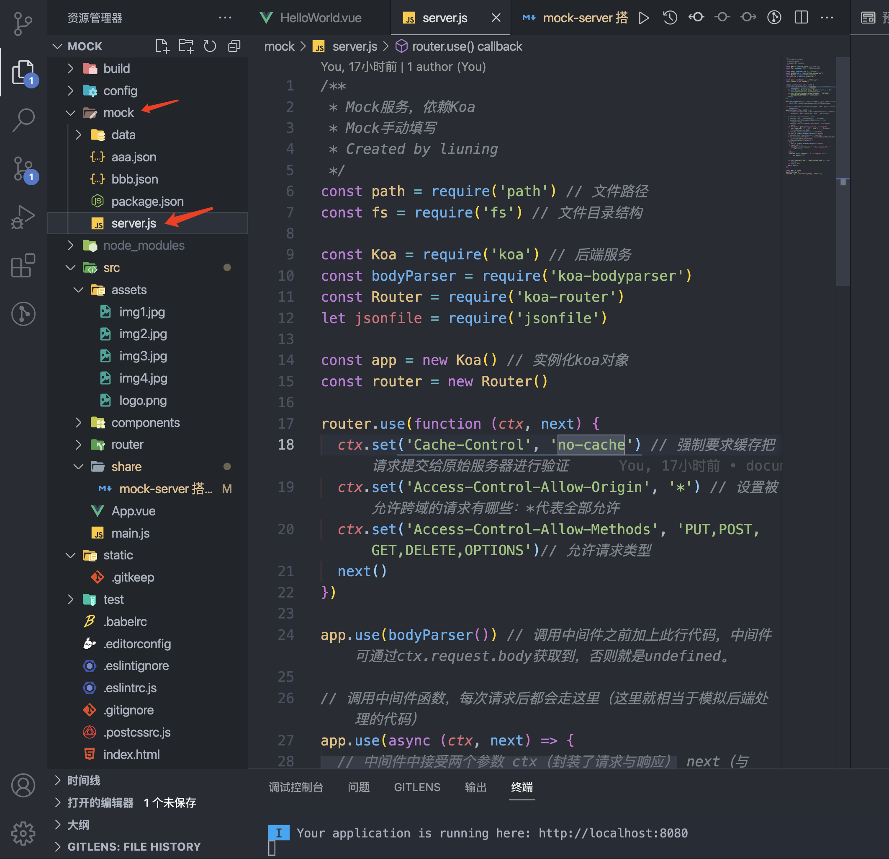

**# 怎么使用 koa2 搭建 mock-server


### 什么是mock-server?
> mock server是专门实现mock功能的一个服务，模拟其它团队/公司提供的相关服务的临时server(模拟数据服务)

### 为什么用mokc-server？
> 作为一名前端开发人员，在日常开发中，不可避免的会和后端联调接口，但是有时候前端页面做完了，后端接口没写完，这样就导致前端的工作无法进一步进行。因此，我们往往会自己造一些数据，来模拟后台请求，将前端的逻辑提前一步写完，等待后端接口写好之后，替换一下地址就行了。

### mock-server具有什么优点？
- 与线上环境一致的接口地址，每次构建前端代码时不需要修改调用接口的代码。
- 所改即所得，具有热更新的能力，每次增加 /修改 mock 接口时不需要重启 mock 服务，更不用重启前端构建服务。
- 能配合 Webpack一起使用。
- mock 数据可以由工具生成不需要自己手动写。
- 能模拟 POST、GET 请求。
- 文件结构简单易于管理。
- 基于Node的 Express web 搭建的一个本地server。
- 数据mock的思路就是在这个本地server端进行，Promise 发出http请求，通过 router 返回mock数据。


## 搭建过程中用到的插件介绍

###  什么是koa（官方简介）？
> 由 Express 原班人马打造的 koa，致力于成为一个更小、更健壮、更富有表现力的 Web 框架。使用 koa 编写 web 应用，通过组合不同的 generator，可以免除重复繁琐的回调函数嵌套，并极大地提升常用错误处理效率。Koa 不在内核方法中绑定任何中间件，它仅仅提供了一个轻量优雅的函数库，使得编写 Web 应用变得得心应手。

- 充分利用async + await + promise的特点，有效的规避了回调函数，且增强了错误处理。
- 快速而愉快地编写服务端应用程序。

### 接着看一下，如何利用koa实现一个后端服务
  

  参考官网[链接][1]

  [1]: https://github.com/guo-yu/koa-guide

 ### 插件 jsonfile、koa-bodyparser、koa-router、pm2了解一下？

 - jsonfile
    > 将返回数据已json格式返回（{ key: value }形式）。参考[链接1][1]、
    [链接2][2]。共有四个api可读可写返回内容。

  [1]: https://m.gxlcms.com/JavaScript-255473.html
  [2]: https://www.pudn.com/news/62d01b26040b80219296c0e9.html
 - koa-bodyparser
    > koa没有内置POST获取请求体的API，故这里要使用第三方包，发送请求后可以获取接口传递的参数，参考[ 链接][1]。

  [1]: https://www.jianshu.com/p/93ad4dcd4eab?u_atoken=6794df98-7a84-4a3c-b6e1-28a388863042&u_asession=01dGp0RhZBUobiMvEPHGv38BAGtK0YrIyb9-0s2ZDGw7TI47dFLe7DYT89ESaL7jPUX0KNBwm7Lovlpxjd_P_q4JsKWYrT3W_NKPr8w6oU7K8EskeXd8hnF2UDi3dMuRqanHmbkqVcEgdObpAroqY1_GBkFo3NEHBv0PZUm6pbxQU&u_asig=0505eyQvUZtlo6qZiZ3pbAbm47YU2Eruon1jYoJc7a_uqxn-o3Zmh3EGyqpQ67lC2XYMkpY3YTKJ-1NLYFQHEB6UoPoN_QRA6CEsT-n1pUR6J4uAbkSEic59f-kVyEvegnGsM26p-O_w5ey0WPQ06DOA2OJ09xr3PbKNcUhRGnNPX9JS7q8ZD7Xtz2Ly-b0kmuyAKRFSVJkkdwVUnyHAIJzS67CRJ66kHxILq913v5PxUA6ldj35r9j8X9gL20mNtL6xbSxAaWh9ph0bRUFW-6vO3h9VXwMyh6PgyDIVSG1W-p19Gz9E4fke4O4X1XFCNUPdP6HxyoHGw6I9ABYWNepnJv6Ykj6ttjJGx3d-oadgCosViMfT0E4l8xylT2fhwPmWspDxyAEEo4kbsryBKb9Q&u_aref=TVvzNViD%2F%2FO%2BdC0KAcl4zcDXXrQ%3D
 - koa-router
    > 定义非常简洁，含义也一目了然，它就是koa的路由中间件。koa为了自身的轻量，不在内核方法中绑定任何中间件，而路由功能对于一个web框架来说，又是必不可少的基础功能。因此koa-router为koa提供了强大的路由功能。参考链接[ 链接][1]。

  [1]: https://blog.csdn.net/qq_31967569/article/details/103784078
 - pm2
    > PM2是JavaScript运行时Node.js的进程管理器。 允许一直保持应用程序活跃，无需停机即可重新加载它们，并促进常见的Devops任务。参考链接[ 链接][1]。

  [1]: https://www.leixue.com/ask/what-is-pm2

### 搭建流程

- 检查node版本是否可以使用koa。(Koa 依赖 node v7.6.0 或 ES2015及更高版本和 async 方法支持.)
  ```
  node -v
  ```

- 在前端工程中安装 koa、jsonfile、koa-bodyparser、koa-router、pm2插件。
  ```
  npm i koa --save/npm i --save koa koa-bodyparser pm2
  ```

- package.json的script中增加启动mock服务命令
  ```
  "scripts": {
    "dev": "webpack-dev-server --inline --progress --config build/webpack.dev.conf.js",
    "start": "npm run dev",
    "unit": "jest --config test/unit/jest.conf.js --coverage",
    "e2e": "node test/e2e/runner.js",
    "test": "npm run unit && npm run e2e",
    "lint": "eslint --ext .js,.vue src test/unit test/e2e/specs",
    "build": "node build/build.js",
    "mock": "pm2 start ./mock/server.js"
  },
  ```
- 配置server.js文件

  


  ```
  /**
  * Mock服务，依赖Koa
  * Mock手动填写
  * Created by liuning
  */
  const path = require('path') // 文件路径
  const fs = require('fs') // 文件目录结构

  const Koa = require('koa') // 后端服务
  const bodyParser = require('koa-bodyparser')
  const Router = require('koa-router')
  let jsonfile = require('jsonfile')

  const app = new Koa()
  const router = new Router()

  router.use(function (ctx, next) {
    ctx.set('Cache-Control', 'no-cache')
    ctx.set('Access-Control-Allow-Origin', '*')
    ctx.set('Access-Control-Allow-Methods', 'PUT,POST,GET,DELETE,OPTIONS')
    next()
  })

  app.use(bodyParser()) // 调用中间件之前加上此行代码，中间件可通过ctx.request.body获取到，否则就是undefined。

  // 调用中间件函数，每次请求后都会走这里（这里就相当于模拟后端处理的代码）
  app.use(async (ctx, next) => {
    let filePath = path.join(__dirname, ctx.request.path.replace('/', '') + '.json') // __dirname 为绝对路径，查找当前文件
    let data = jsonfile.readFileSync(filePath)
    // fs.existsSync(filePath) 检测目录是否存在，如果存在返回true，如果不存在返回false
    if (fs.existsSync(filePath)) {
      try {
        data = jsonfile.readFileSync(filePath)
      } catch (err) {
        console.error('request: ' + ctx.request.url + ' fail!!!')
      }
    } else {
      console.warn('request: ' + ctx.request.url + ' not exist!!!!')
    }
    // 设置单独响应头
    ctx.set('Content-Type', 'application/json')
    ctx.body = data
    await next()
  })

  const port = 18080
  app.listen(port)
  console.log(`'localhost:${port} listen!!!`)
  ```

- app.use中回调参数ctx都有哪些options
-    


- 修改vue全局配置文件中的 proxyTable 内容

  ```
      proxyTable: {
        '/api': {
          target: 'http://localhost:18080',
          changeOrigin: true // 必须设置true。否则服务端会有代理跨域报错
        },
      },
  ```

- 增加后端返回数据文件并借助axios完成请求过程

### 整个流程就是上面描述这样，现在就让我们以mock工程为例，编写自己的mock-server工具吧。
**
